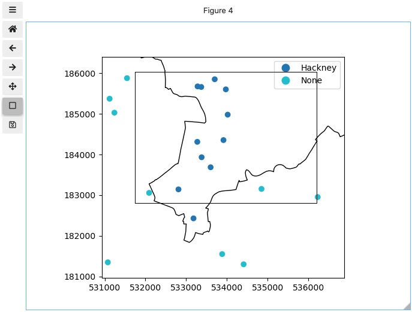
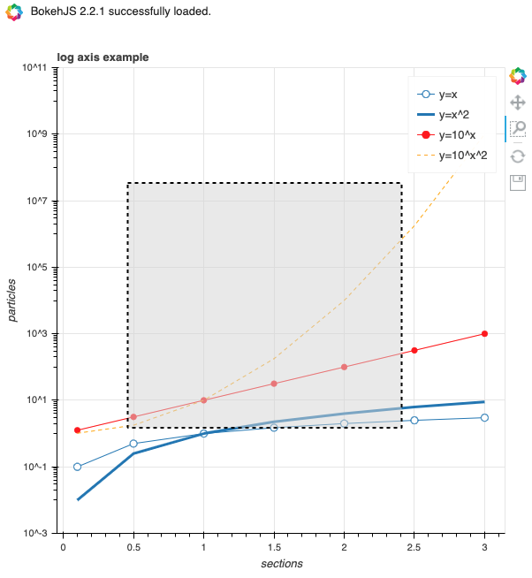

Theme: casa notes
Palette: Purple
Size: Wide
Title: File Formats
Author: Jon Reades

---

Layout: Title

# Visualising Data

Python and Jupyter give us a range of ways to visualise data; broadly these are:

1. `matplotlib`: the 'big beast' of visualisation in Python and offered as a default by Python, Pandas, GeoPandas, etc. Does best at 2D and 3D static visualisations. Highly customisable. Highly complex.
2. `seaborn`: a layer that sits over top of `matplotlib` and makes it easier to produce good-quality graphics.
3. `jupyter`: as a web-based tool Jupyter allows us, via extensions, to do rather more than just display static visualisation. 
4. `bokeh`: web-based visualisation tool that can be integrated to Jupyter or output to static HTML files.

Beyond this you have tools based on `node.js` like Uber's Kepler, D3, etc. *Each* of these takes its own approach. There's even a Python port of `ggplot` (from [yhat](http://ggplot.yhathq.com/) or [plotnine](https://plotnine.readthedocs.io/en/stable/index.html)).

---

## Seaborn

Designed to provide ggplot-*like* quality output using matplotlib back-end:

- Improve on default colourmaps and colour defaults.
- Integration with pandas data frames (*Note: no geopandas!*).
- Offer more plot types out of the box.
- Still offer access to matplotlib's back-end.

---

### Plot Types


^ Some of these aren't even available in ggplot! 😀

^ Many have variations (e.g. hexbinning is an *option* for a joint plot) and facetting is also an option.

---

### In Practice

```python
import seaborn as sns
sns.set_theme(style="darkgrid")
fmri = sns.load_dataset("fmri")
sns.lineplot(x="timepoint", y="signal",
             hue="region", style="event",
             data=fmri)
```


---

### In Practice 2: Swarm Plots

```python
import seaborn as sns
sns.set_theme(style="whitegrid", palette="muted")

# Load the penguins dataset
df = sns.load_dataset("penguins")

# Draw a categorical scatterplot to show each observation
ax = sns.swarmplot(data=df, x="body_mass_g", y="sex", hue="species")
ax.set(ylabel="")
```


---

### Configuring Seaborn

Seaborn provides a number of useful themes that act as shortcuts for setting multiple matplotlib parameters:

| Seaborn Command                                              | Accomplishes                                                 |
| ------------------------------------------------------------ | ------------------------------------------------------------ |
| [`set_theme`](https://seaborn.pydata.org/generated/seaborn.set_theme.html#seaborn.set_theme)([context, style, palette, font, …]) | Set multiple theme parameters in one step.                   |
| [`axes_style`](https://seaborn.pydata.org/generated/seaborn.axes_style.html#seaborn.axes_style)([style, rc]) | Return a parameter dict for the aesthetic style of the plots. |
| [`set_style`](https://seaborn.pydata.org/generated/seaborn.set_style.html#seaborn.set_style)([style, rc]) | Set the aesthetic style of the plots.                        |
| [`plotting_context`](https://seaborn.pydata.org/generated/seaborn.plotting_context.html#seaborn.plotting_context)([context, font_scale, rc]) | Return a parameter dict to scale elements of the figure.     |
| [`set_context`](https://seaborn.pydata.org/generated/seaborn.set_context.html#seaborn.set_context)([context, font_scale, rc]) | Set the plotting context parameters.                         |

You can also access 

- [Palettes](https://seaborn.pydata.org/tutorial/color_palettes.html): colormaps can be generated using `sns.color_palette(...)` and set using `sns.set_palette(...)`.
- [Axes Styles](https://seaborn.pydata.org/generated/seaborn.axes_style.html#seaborn.axes_style): includes 'darkgrid', 'whitegrid', 'dark', 'white', 'ticks'.

---

## Matplotlib


Source: [Anatomy of a figure](https://matplotlib.org/gallery/showcase/anatomy.html#anatomy-of-a-figure).

---

### Writing to Plots

Confusingly, there are multiple ways to access elements of the plot and write into them:

- Figure: high-level features (*e.g.* title, padding, etc.). Can be accessed via `plt.gcf()` (**g**et **c**urrent **f**igure) or upon creation (e.g. `f, ax = plt.subplots()` or `f = plt.figure()`).
- Axes: axis-level features (e.g. labels, tics, spines, limits, etc.). Can be accessed via `plt.gca()` (**g**et **c**urrent **a**xes) or upon creation (e.g. `f, ax = plt.subplots()` or `ax = f.add_subplot(1,1,1)`).

Annotations, artists, and other features are *typically* written into the axes *using the coordinate space of the figure* (e.g. decimal degrees for lat/long, metres for BNG, etc.).

---

### Adding a 3rd Dimension

This 'feature' is less well-developed but *does* work:

```python
from mpl_toolkits.mplot3d import Axes3D
fig = plt.figure()
ax  = plt.axes(projection='3d')
# OR
fig = plt.figure()
ax  = fig.add_subplot(111, projection='3d')
# THEN
ax.contour3D(X, Y, Z, ...)
ax.plot_surface(x, y, z, ...)
ax.plot3D(xline, yline, zline, ...)
ax.scatter3D(x, y, z, ...)
# ax.plot_surface and ax.plot_wire also give you 3D renderings
```

You can then set the elevation and azimuth using: `ax.view_init(<elevation>, <azimuth>)`.

---

### Saving Outputs

Straightforward via [save figure](https://matplotlib.org/3.1.1/api/_as_gen/matplotlib.pyplot.savefig.html) function, but lots of options!

```python
plt.savefig(fname, dpi=None, facecolor='w', edgecolor='w',
        orientation='portrait', papertype=None, format=None,
        transparent=False, bbox_inches=None, pad_inches=0.1,
        frameon=None, metadata=None)
```

The format can be largely determined by the file extension in the `fname` (file name) and the supported formats depends on what you've installed! You can find out waht's available using: `plt.gcf().canvas.get_supported_filetypes()`. Also:

- `dpi` = dots-per-inch (>300 dpi == publication quality).
- PDFs are always a good choice if you're going to do any post-editing (since it allows fonts to remain editable... sometimes) and can be included directly into $\latex$ documents.
- TIFFs are your next-best choice for high-quality output as they are older standard for printing.

---

## Jupyter

By default, Jupyter's output is static matplotlib, but we can extend this in three ways:

1. Make the static plot zoomable and pannable using `%matplotlib widget` (declare this at the top of your notebook).
2. Make the plot more directly interactive using `ipywidgets` (import `interact` and related libs as needed).
3. Use a browser-based visualisation tool such as `bokeh` or `d3` (format may be very, very different from what you are 'used to' in Python).

---

### Widgets

```python
%matplotlib widget
rs = gpd.sjoin(gdf, hackney, how='left', op='within')
rs.NAME.fillna('None', inplace=True)
ax = boros[boros.NAME=='Hackney'].plot(edgecolor='k', facecolor='none')
rs.plot(ax=ax, column='NAME', legend=True)
```




---

### Interact()


---

## Bokeh



---

## Automation

Because of the way that matplotlib and Jupyter work, all resources built on top of these 'platforms' can, to some extent, be automated using functions. For example to draw circles and place text:

```python
def circle(x, y, radius=0.15):
    from matplotlib.patches import Circle
    from matplotlib.patheffects import withStroke
    circle = Circle((x, y), radius, clip_on=False, zorder=10, linewidth=1,
                    edgecolor='black', facecolor=(0, 0, 0, .0125),
                    path_effects=[withStroke(linewidth=5, foreground='w')])
    ax.add_artist(circle)

def text(x, y, text):
    ax.text(x, y, text, backgroundcolor="white",
            ha='center', va='top', weight='bold', color='blue')
```

Or, taking an example from [Dani's work](https://darribas.org/gds_course/content/bH/lab_H.html#advanced-plotting):

```python
from ipywidgets import interact, interactive, fixed, interact_manual
interact(
    clusters,                 # Function to make interactive
    db=fixed(tokyo),          # Data to pass on db (does not change)
    eps=(50, 500, 50),        # Range start/end/step of eps
    min_samples=(50, 300, 50) # Range start/end/step of min_samples
);
```

---

## Resources

- [Introduction to PyPlot](https://matplotlib.org/3.1.0/tutorials/introductory/pyplot.html) (includes lots of parameter information)
- [Visualisation with Seaborn](https://jakevdp.github.io/PythonDataScienceHandbook/04.14-visualization-with-seaborn.html)
- [Seaborn Tutorial](https://jakevdp.github.io/PythonDataScienceHandbook/04.14-visualization-with-seaborn.htmlhttps://seaborn.pydata.org/tutorial.htmlhttps://elitedatascience.com/python-seaborn-tutorialhttps://www.datacamp.com/community/tutorials/seaborn-python-tutorial)
- [Elite Data Science Seaborn Tutorial](https://elitedatascience.com/python-seaborn-tutorial)
- [Datacamp Seaborn Tutorial](https://www.datacamp.com/community/tutorials/seaborn-python-tutorial)
- [Three-Dimensional Plotting in Matplotlib](https://jakevdp.github.io/PythonDataScienceHandbook/04.12-three-dimensional-plotting.html)
- [An easy introduction to 3D plotting with Matplotlib](https://towardsdatascience.com/an-easy-introduction-to-3d-plotting-with-matplotlib-801561999725)

