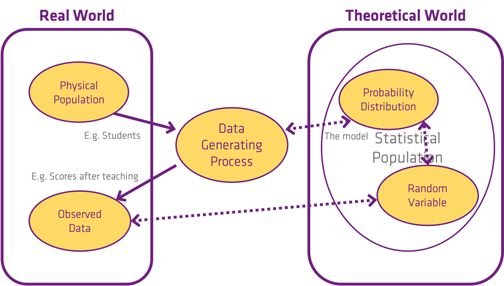
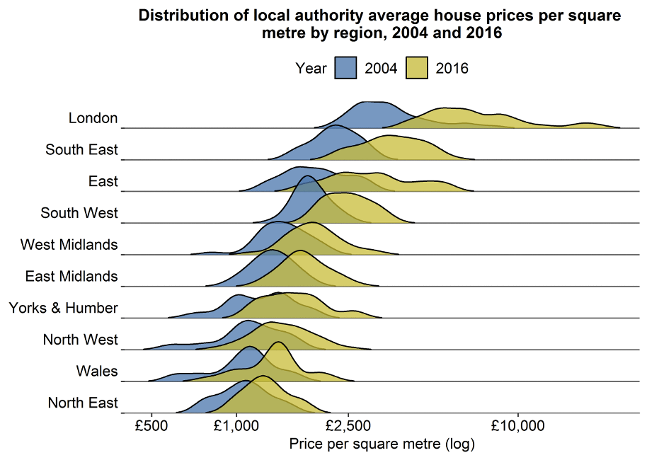
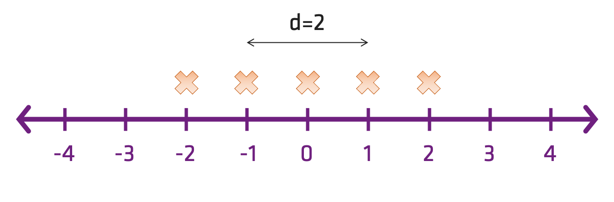
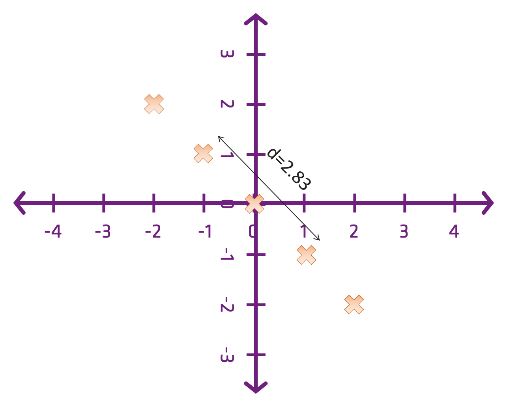
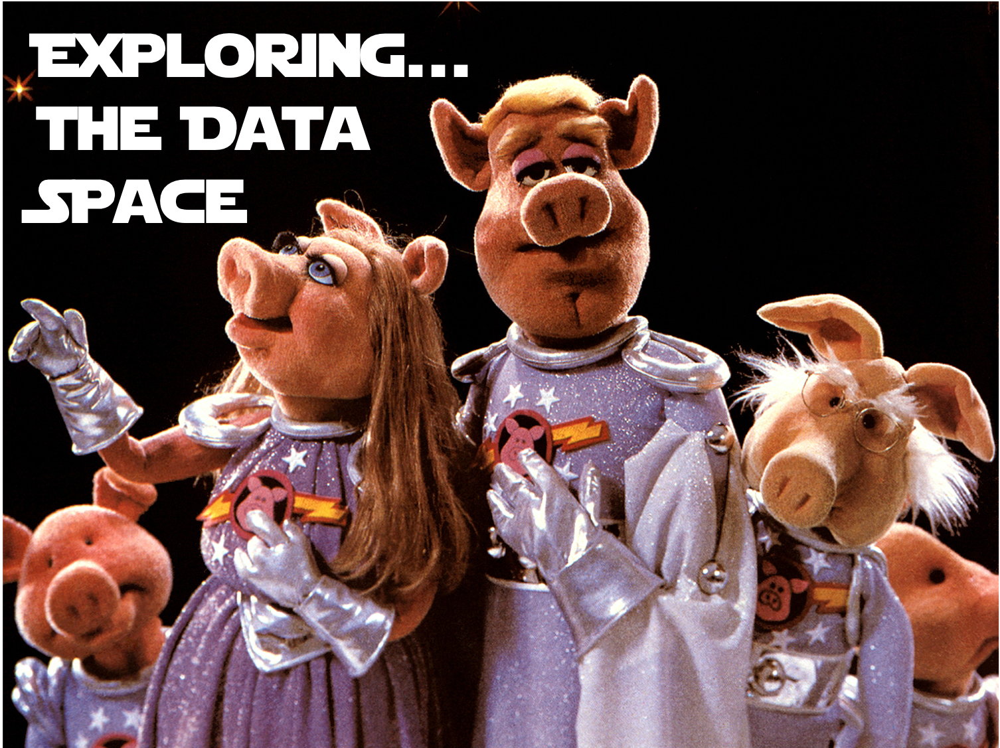

Theme: casa notes
Palette: Purple
Size: Wide
Title: File Formats
Author: Jon Reades

---
Layout: Title
# The Data Space...

---

> Where does data come from?

---
## The Data Generating Process

---
## The Data Generating Process

---
### The Data Generating Process

---
### Cashier Income as DGP

*Question*: Retail cashier annual salaries have a Normal distribution with a mean equal to $25,000 and a standard deviation equal to $2,000. What is the probability that a randomly selected retail cashier earns more than $27,000?

*Answer*: 15.87%

*Result*: All models are wrong, but some are useful (George Box)

---
### House Prices as DGP

---
Layout: SectionTitle
## Distance...

---
## So...

Instinctively, we know that Bill Gates' wealth is much further from 'normal' than is his height. But **how**?

- How can we *compare* income and height if they share no common units?
- How can we compare the biodiversity of a site in a tropical part of the world with that of a sub-Arctic area given that there are different numbers of species to begin with?

We need ways to **make different dimensions comparable**, and we need ways **to remove unit effects from distance measures**.

---
### Distance in 1D

$$
d(i,j) = (i_{1}-j_{1})
$$

---
### Distance in 2D

$$
d(i,j) = \sqrt{(i_{1}-j_{1})^{2}+(i_{2}-j_{2})^{2}}
$$

---
### Distance in 3D... or More

We can keep adding dimensions...

$$
d(i,j) = \sqrt{(i_{1}-j_{1})^{2}+(i_{2}-j_{2})^{2}+(i_{3}-j{3})^{2}}
$$

At a certain point you are dealing with hyperspaces!

---
### Thinking in *Data* Space

We can write the coordinates of an observation with 3 attributes (*e.g*. height, weight, income) as:
$$
x_{i} = \{x_{i1}, x_{i2}, x_{i3} \}
$$
 And we can think of something with 8 attributes (*e.g*. height, weight, income, age, year of birth, ...) as occupying an *8-dimensional space* (which, for obvious reasons, we can’t plot in one go).

---
### Two Propositions

1.*That geographical space is* **no different** *from any other dimension in a data set.*

2.*That geographical space is* **still special** *when it comes to thinking about relationships.*

---

---
### Resources

- 