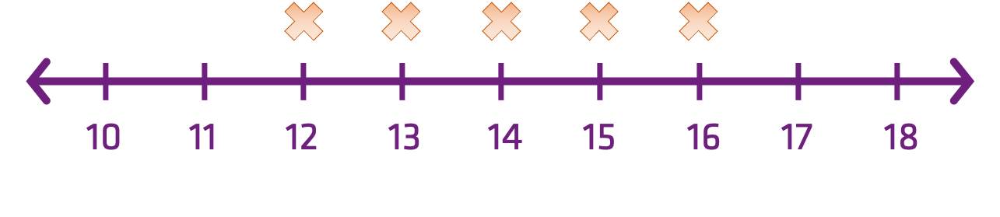
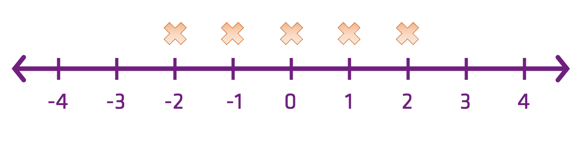
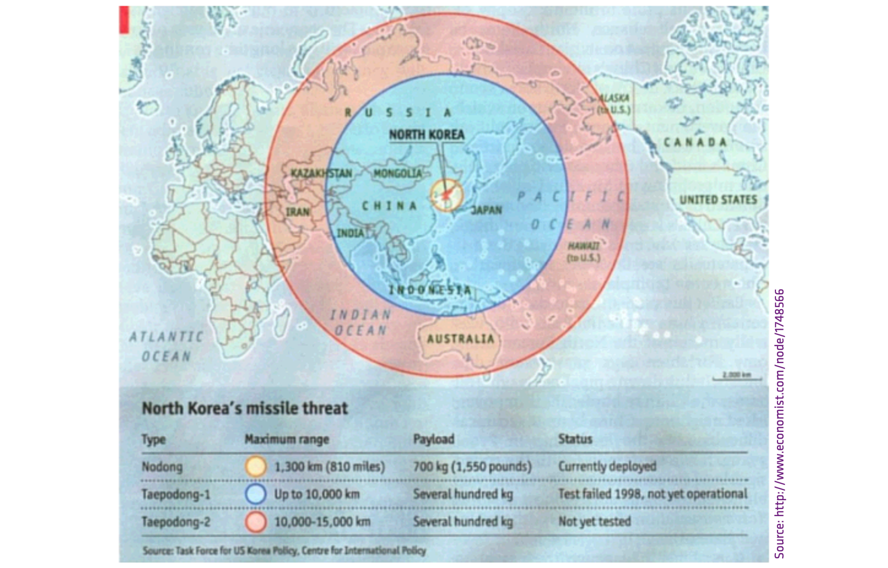
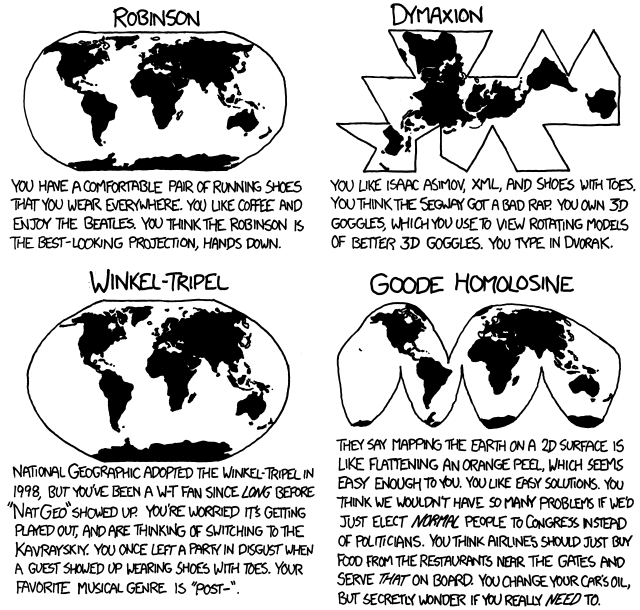

Theme: casa notes
Palette: Purple
Size: Wide
Title: File Formats
Author: Jon Reades

---
Layout: Title
# Transformation

---
## What is it?

Data *transformation* just means changing the raw data in some way to make it more tractable for analysis.

- Centering the mean on zero is an obvious example.
- But we can also do quite complicated things (with caution!) in order to get a distribution that we can work with using statistical tests that have certain expectations about the data we’re feeding them.

^ So, even though we add or subtract, multiply or divide, square or log the data, because we are doing the *same thing* to *every* observation the underlying relationships between the data are ‘unchanged’.

---
### Transformation in 1D



---
### Transformation in 1D

$$
x-\bar{x}
$$



^ How is this any different?

---

### So...

> Transformations are **mathematical operations** applied to every observation in a data set that preserve **some** of the relationships between them.

---
### For Example

If we subtract the mean from everyone's height then we *can* immediately tell if someone is taller or shorter *than we would expect*.

If we subtract the mean from everyone's income then we *cannot* immediately tell if someone is earning more or less *that we would expect*.

So what is a **useful transformation** in one context, may not be in another!

---
### Fleshing This Out

*Question*: How can you tell if you did *better* **than everyone else** on the *Quiz* or on the *Data Set Biography*?

*Answer*: Just subtracting the mean is *not enough* because the distributions are not the same. For *that* we also need to standardise the data in some way.

$$
z = \dfrac{x-\bar{x}}{\sigma}
$$

Divide through by the distribution!

---
Layout: SectionTitle
# Standardisation

---
### Z-Score Standardisation

$$
\dfrac{x-\bar{x}}{\sigma}
$$

```python
from sklearn.preprocessing import StandardScaler
scaler = StandardScaler()
scaler.fit(data)
print(scaler.mean_)
scaler.transform(data)
scaler.transform(<new data>)
```

^ The important thing to note is that if transform data that has not been fit *and* you get values outside the range used for fitting then you can no longer assume a standard normal.

---
### Interquartile Standardisation

$$
\dfrac{x_{i}-x_{Q2}}{x_{Q3}-x_{Q1}}
$$

```python
from sklearn.preprocessing import RobustScaler
trf = RobustScaler(
		quantile_range=(25.0,75.0)).fit(<data>)
trf.transform(<data>)
```


---
### Interdecile Standardisation

$$
\dfrac{x_{i}-x_{50^{th}}}{x_{90^{th}}-x_{10^{th}}}
$$

```python
print("You've got this...")
```

^ Why standardise: 
^ - We understand the properties of normal-ish distributions, and can simulate them easily.
^ - More 'power' in the statistical tools available.
^ - Many analyses assume that 'error' is random and symmetric (homoscedastic, not skewed).

---
Layout: SectionTitle
## Normalisation

^ (Typically) About rescaling data to a range of [0,1].

---
### Proportional Normalisation

$$
\dfrac{x_{i}}{\sum{x}_{i=1}^{n}}
$$

```python
import numpy as np
data = <list>
data/np.sum(data)
```

---
### Range Normalisation

$$
\dfrac{x_{i}-x_{min}}{x_{max}-x_{min}}
$$

```python
from sklearn.preprocessing import MinMaxScaler
scaler = MinMaxScaler()
scaler.fit(data)
print(scaler.data_max_)
scaler.transform(data)
scaler.transform(<new data>)
```

^ Normalisation helps in several ways:
^ - Scaling is important for comparability
^ - Clustering is particularly sensitive to scale

---
Layout: SectionTitle
## Non-Linear Transformations

---
### Log Transformation

Recall: logs are the *inverse* of exponentiation!

- So if $$10^{3} = 1,000$$ then $$log_{10}(1,000) = 3$$.
- And if $$10^{0} = 1$$ then $$log_{10}(1) = 0$$

The Natural Log ($$e$$) has certain advantages over other logs.

^ Why is this so common? Esp. in social sciences?

---
### Why Log Transform?

Consider:

- The formula for the mean is $$\frac{\sum{x}}{n}$$.
- The formula for variance is $$\frac{(x-\bar{x})^{2}}{n}$$.

Consider what happens if $$(x-\bar{x})$$ is 10, 100, 1,000, or 10,000?

---
### Other Transforms...

- Quantile (maps the PDF of each feature to a uniform distribution)
- Square Root (often with count data)
- Arcsine/Angular (with percentages, proportions, text)
- Rank (with care on extreme distributions)
- Box-Cox and Yeo-Johnson (arbitrary power transformations)

^ - To report measures of central tendency it's usually helpful to convert back to the original units.
^ - The more extreme the transformation the less meaningful measures of dispersion.
^ - Correlation can be significantly affected in either direction.
^ - Count data can be tricky because you should not have negative values (especially $$-\infty$$).


---
### When Transforms Don't Help

Arbitrarily transforming data isn’t a panacea. ‘Robust’ tests can be another approach when all else fails and two common approaches are:

- Working with the ‘Trimmed Mean’: cutting off, say, the top and bottom 5% of scores would start to remove skew and offer a more useful view of the central tendency of the data.
- Bootstrapping: by taking many sub-samples (usually of $$n-1$$ data points or similar) we can build a picture of how certain metrics vary. 

---
### One Last Note

> The term normalization is used in many contexts, with distinct, but related, meanings. Basically, normalizing means transforming so as to render normal. When data are seen as vectors, normalizing means transforming the vector so that it has unit norm. When data are though of as random variables, normalizing means transforming to normal distribution. When the data are hypothesized to be normal, normalizing means transforming to unit variance.

Source: [Stack Exchange](https://stats.stackexchange.com/a/69200)

---
Layout: SectionTitle
## Transforming Spatial Data

^ All maps are inaccurate, the question is **by how much**?

---
### What's Wrong with this Map?



---
### That's Better!


---
### What's a Projection?



[Source](http://imgs.xkcd.com/comics/map_projections.png)

---

> Are spatial (a.k.a. geometrical) transformations any different from the other mathematical transformations covered in this session?
> Data exists in a ‘space’ that we can transform and manipulate in various ways **using functions** to serve our exploratory and analytical purposes.

---
### Resources

- [Normalisation vs Standardisation -- Quantitative analysis](https://towardsdatascience.com/normalization-vs-standardization-quantitative-analysis-a91e8a79cebf)
- [Transforming Data with R](https://www.youtube.com/watch?v=5571wc0iWCI)
- [Data Transformation and Normality Testing](https://www.youtube.com/watch?v=57An8xx3WjA)
- [Introduction to Logarithms](https://youtu.be/ntBWrcbAhaY)
- [What is 'e' and where does it come from?](https://youtu.be/pg827uDPFqA)
- [Logarithms - What is `e`?](https://youtu.be/_-x90wGBD8U)
- [sklearn API reference](https://scikit-learn.org/stable/modules/classes.html#module-sklearn.preprocessing)
- [Compare effects of different scalers on data with outliers](https://scikit-learn.org/stable/auto_examples/preprocessing/plot_all_scaling.html#sphx-glr-auto-examples-preprocessing-plot-all-scaling-py)

